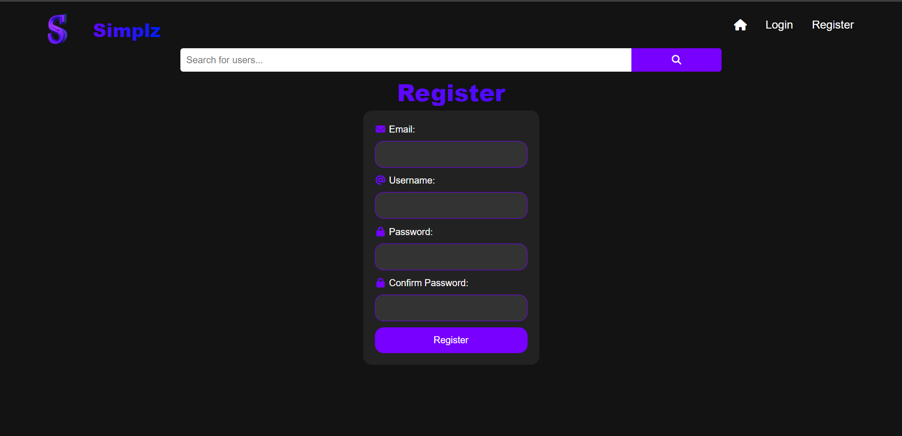
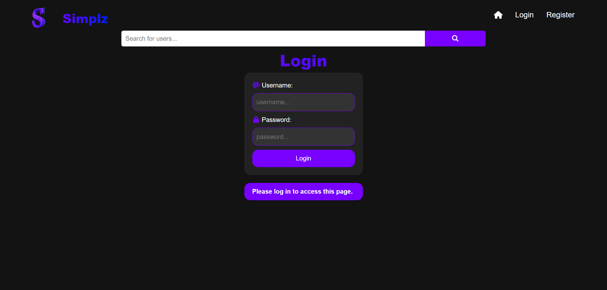
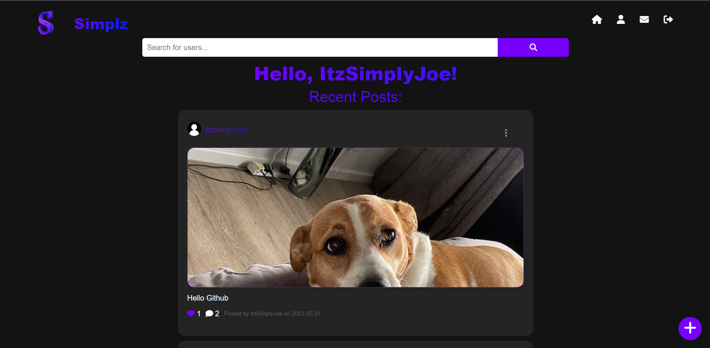
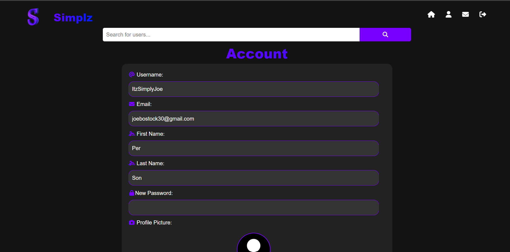
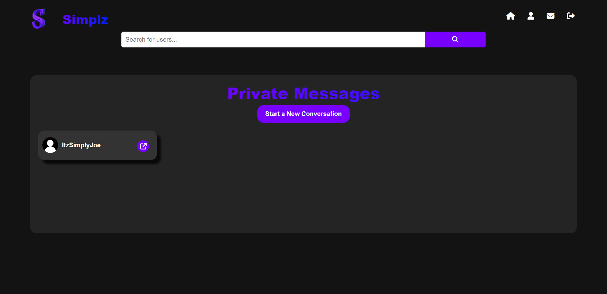
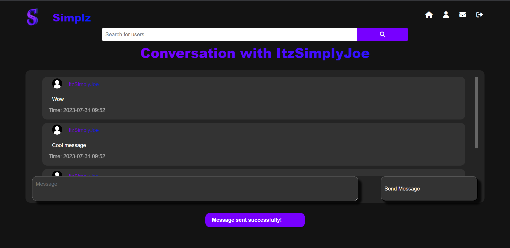
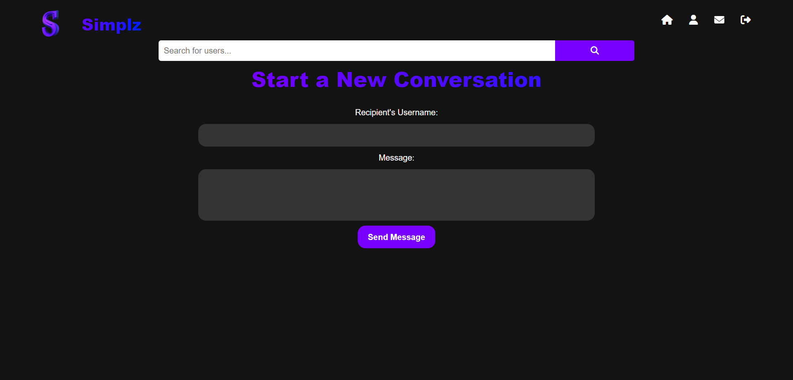
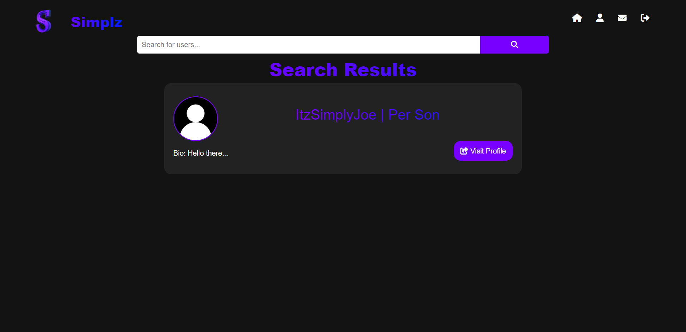
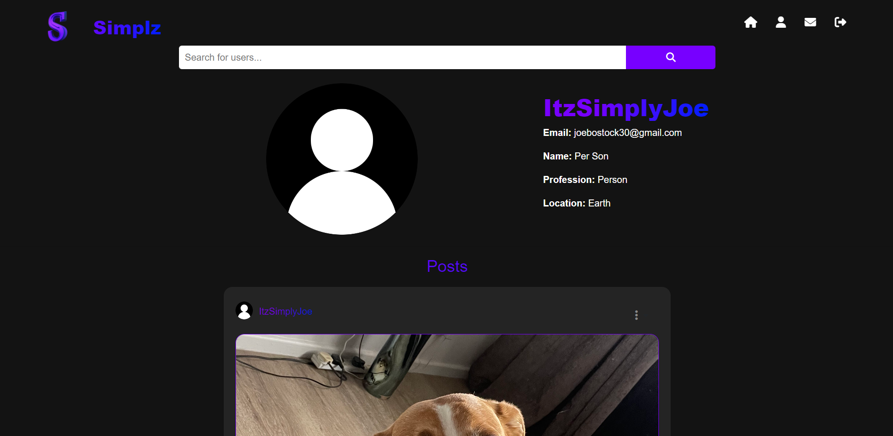

# Flask Social Media App

## Information
A simple social media app called Simplz made with Flask, HTML, CSS and JS.

## Installation
If you want to run the program and change it for yourself then
- `git clone https://github.com/ItzSimplyJoe/Social-Media-App.git`
- `cd social_network`
- `pip install -r requirements.txt`
- `python app.py`

## What it can do
### Register Page

Create an Account with the easy-to-follow and easy-to-understand Register Page

### Login Page

Log into your account with the Login Page

### Home Page

See all the posts from the people you follow on the Home Page

Here you can also create your own posts by clicking the + button in the bottom right corner

### Account Settings Page

Change your account settings on the Account Settings Page

### Messages Page

Send messages to other users on the Messages Page

### Search For other Users Page

Search for other users on the Search Page

## License
[MIT](https://choosealicense.com/licenses/mit/)

## Contact
If you want to contact me you can reach me at [my email](mailto:joebostock30@gmail.com) or [my website](https://www.itzsimplyjoe.me).

## Contributing
If you want to contribute to this project you can by making a Pull Request.

## Acknowledgements
- [Python](https://www.python.org/)
- [Flask](https://flask.palletsprojects.com/en/2.0.x/)
- [SQLAlchemy](https://www.sqlalchemy.org/)
- [Flask Login](https://flask-login.readthedocs.io/en/latest/)
- [Flask WTF](https://flask-wtf.readthedocs.io/en/0.15.x/)
- [Flask Migrate](https://flask-migrate.readthedocs.io/en/latest/)
- [Bootstrap](https://getbootstrap.com/)
- [Font Awesome](https://fontawesome.com/)
- [JQuery](https://jquery.com/)
- [Popper.js](https://popper.js.org/)
- [werkzeug](https://werkzeug.palletsprojects.com/en/2.0.x/)
